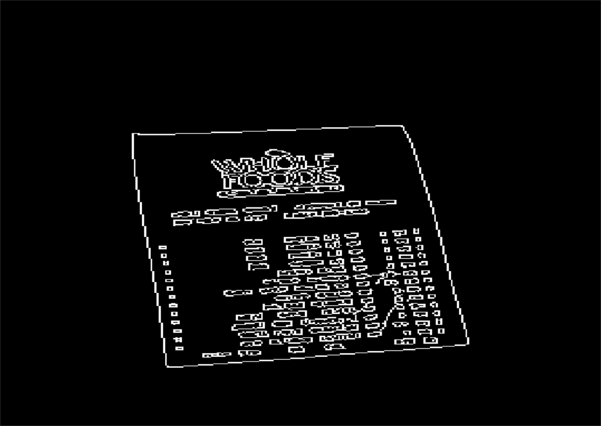

# DocumentDetection-Discarded-
使用opencv实现文档检测（简易版），可以检测文档的四个顶点。不足之处颇多，仅作为个人学习只用。

## 基于opencv
本demo功能实现基于opencv**4.1.1**，运行平台为**vs2017**。
## 功能图
> **轮廓检测图**，基于canny算法

> **边缘检测图**, 基于findContours算法

> **文档顶点检测图**, 基于approxPolyDP()算法

## 效果
对于简单图来说效果尚好，一旦前景和背景出现复杂情况，很难检测文档边缘。
解决方法：深度学习

## 后期计划

待续

